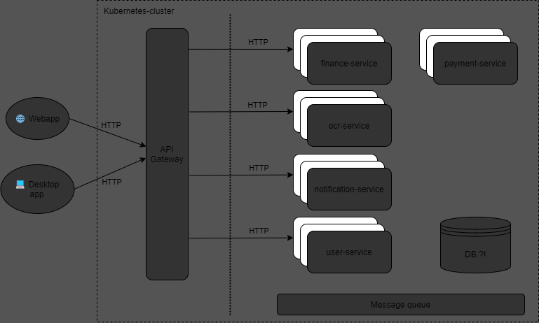

# Kubernetes

## Minikube

Installation guide:

https://minikube.sigs.k8s.io/docs/start/


## Addons needed
The following addons needs to be enabled:

| Addon                         | Description | 
| :---                          |:----   |  
| Dashboard                     | Enables kubernetes web-dashboard        | 
| default-storage               | ??? (defaults)       |
| ingress                       | Public interface to access services from outside        |
| ingress-dns                   | DNS for ingress        |
| registry                      | Docker-registry for image       |
| storage-provisioner-gluster   | ??? (defaults)          |

```
eval $(minikube docker-env)
skafold build -t sc-financetracker/XXXX:TAG
```

### System-diagram
[](images/test.png)


## argo-cd

t.b.d.

## bitnami-sealed-secrets

t.b.d.

## cert-manager

t.b.d.
## rabbit mq
t.b.d.
